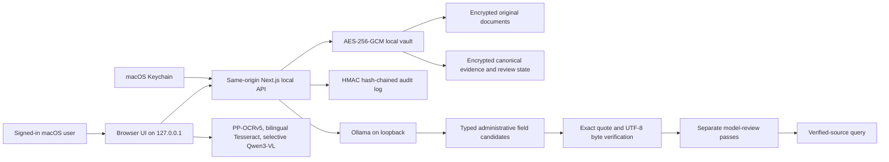

# Offline Local-Appliance Architecture

## Purpose

The local-appliance profile allows a firm to operate Verity Caseworks without
sending evidence, canonical text, prompts, embeddings, or model output over an
external network. It is intended for a managed workstation that is part of the
firm's HIPAA security program.

This profile supplies technical safeguards. It does not certify the firm,
workstation, workforce, or legal process as HIPAA compliant.

## Runtime architecture

Both application and model endpoints must use a loopback address. The server
rejects local API requests received under a non-loopback host and rejects model
URLs that do not use `http://127.0.0.1`, `http://localhost`, or `http://[::1]`.

## Control ownership

### Local application

- random encryption key protected by the signed-in user's macOS Keychain;
- AES-256-GCM encryption for source documents and workspace state;
- private filesystem permissions on the vault directory and files;
- operating-system account identity for the single-user appliance;
- same-origin mutation checks;
- encrypted retention of original source bytes;
- append-only automatic verification and review-decision history;
- HMAC hash-chained audit records with a separately protected macOS Keychain
  head checkpoint for rollback detection;
- legal-hold deletion enforcement;
- encrypted backup generation;
- file, batch, PDF-page, decoded-pixel, render-pixel, and request-size limits;
- spreadsheet formula neutralization;
- deterministic hash and exact-byte citation verification;
- approved-record-only query output.

### Local model

Ollama receives canonical page text over loopback. The gateway:

- permits no remote model hostname;
- rejects model identifiers containing `cloud`;
- uses a configured local model only;
- exposes no tools or file access to the model;
- treats source instructions as untrusted evidence;
- requires structured JSON output;
- discards any quotation that is not present at an exact canonical byte range;
- publishes only exact server-verified source spans as authoritative claims;
- uses the model for query selection only, while deterministic code retrieves
  and verifies the selected facts and citations.

### Firm and workstation

The firm must supply the controls that an application cannot:

- full-disk encryption and secure boot;
- operating-system login, MFA where required, auto-lock, patching, EDR, and
  controlled administrator access;
- browser policy, extension allowlisting, download controls, and DLP;
- secure backup destination and tested restoration;
- risk analysis, sanctions, training, incident response, breach assessment,
  retention schedules, and periodic control review;
- physical workstation and facility safeguards.

## Data lifecycle

1. The reviewer selects a file in the browser.
2. The browser enforces batch and file limits and parses the file locally.
3. Local PP-OCRv5 processes image-only pages first; bilingual bundled Tesseract and selective Qwen3-VL provide bounded fallbacks.
4. The original file is encrypted into `~/.verity-caseworks/data/originals` (or the configured absolute local-data directory), outside the repository and production build tree.
5. Canonical text, hashes, page provenance, and OCR provenance are created.
6. Canonical page text is sent only to loopback Ollama.
7. Model-returned quotations are matched to exact canonical UTF-8 bytes.
8. Two separate review passes must agree on each proposed source span.
9. Application code rehydrates the exact quotation; model-authored summaries
   are not promoted as authoritative claims.
10. Restricted lookup selects verified typed occurrence IDs; application code verifies
    every citation before display.
11. Exports are built from a single transactionally consistent verified
    snapshot. SQLite, DOCX, XLSX, PDF, CSV, and JSONL outputs share stable record
    and citation IDs; the package includes originals, canonical artifacts,
    provenance, a manifest, and SHA-256 checksums. Final export is unavailable
    while a document still awaits OCR. Open exports must be written only to an
    encrypted, access-controlled destination.
12. Export creation and downloads are recorded in the
    local audit log.
13. Matter deletion is blocked by an active legal hold.

## Deployment profiles

| Profile | Intended data | Persistence | Model |
| --- | --- | --- | --- |
| Vercel pilot | Synthetic or de-identified only | Browser IndexedDB | None |
| Offline local appliance | PHI only after organizational approval | Encrypted local vault | Loopback Ollama |
| Future private cloud | Separately reviewed | Private encrypted services | BAA-covered or private endpoint |

The public Vercel profile must never be changed into the PHI profile merely by
setting `PHI_MODE`. Local technical mode requires `LOCAL_ONLY_MODE=enabled`,
loopback binding, macOS Keychain access, and successful readiness checks.
