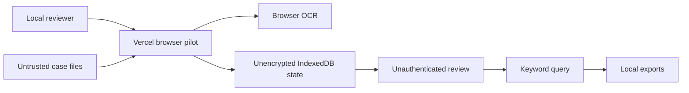
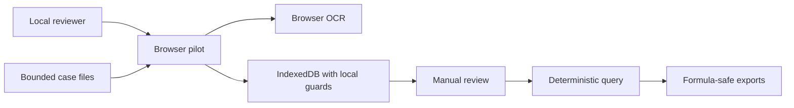
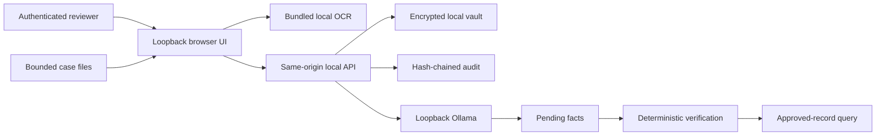

# Security Hardening Proposal: Own the offline PHI boundary

## Decision

Choose whether protected work remains a browser-only convention or moves behind
an authenticated loopback service that owns storage, model access, audit, and
retention enforcement.

## Executive Recommendation

Option 1, **Strengthened browser pilot**, keeps the current topology and applies
focused parser and export fixes. Option 2, **Loopback local appliance**, adds an
encrypted vault, authenticated local service, tamper-evident audit records, and
an Ollama-only model gateway. I recommend Option 2 for protected work. Option 1
should remain the Vercel demonstration profile.

## Evidence

| Evidence | Finding or source | What it establishes |
| --- | --- | --- |
| `F1` | CSV formula injection | Untrusted document text crossed an export interpretation boundary without a safe serializer. |
| `F2` | Parser resource exhaustion | Untrusted files had no explicit processing budget. |
| `C1` | Browser persistence review | IndexedDB had no application identity, encryption, audit, backup, or legal-hold owner. |
| `C3` | Exact citation implementation | Canonical hashing and UTF-8 byte matching are worth preserving. |

I inspected the source paths behind these items. The structural issue is not
that browser APIs are inherently unsafe; it is that no component owned the
complete protected-data lifecycle.

## Current Design And Failure Mode

The public pilot serves code from Vercel and keeps case state in one browser
profile. That sharply reduces cloud egress, but it delegates confidentiality,
identity, availability, and deletion to ambient endpoint behavior. A reviewer
label is not authentication, IndexedDB is not a managed evidence vault, and a
button that deletes one key is not a retention system.

## Desired Invariants

- Protected evidence and prompts never leave loopback.
- Every stored original and canonical artifact is authenticated encryption.
- Every review and export is attributable to an authenticated identity.
- Every answer uses approved records and deterministic citation verification.
- Legal hold blocks deletion at the storage boundary.
- Every untrusted parser operation has an explicit resource budget.
- Local-model failure never falls back to a cloud provider or unverified claim.

## Constraints And Non-Goals

The design must work without internet after installation and model download. It
does not replace firm policies, physical controls, operating-system identity,
MFA, EDR, breach response, or legal review. Multi-user network collaboration is
outside this local profile.

## Before Architecture

The evidence boundary and user boundary collapse into one browser profile. That
is convenient, but recovery and audit evidence are fragile.

## Options

### Option 1: Strengthened browser pilot

This option keeps the current deployment and adds parser budgets, export
sanitization, stricter UI warnings, and stronger tests. Its strongest case is
simplicity: no local server, password lifecycle, or model process is added.
Performance remains close to the existing browser path and rollback is a normal
frontend revert.

The limitation is structural. Browser persistence still cannot reliably own
unique identity, encrypted originals, hash-chained audit records, backup
restoration, or legal-hold enforcement. We can make the pilot safer, but those
controls remain endpoint conventions rather than application invariants.

| Change | Before | After | Security consequence | Cost |
| --- | --- | --- | --- | --- |
| Parser budget | Unbounded | Explicit limits | Narrows local denial of service | Some large files rejected |
| CSV encoding | Formula-capable | Formula-neutralized | Removes spreadsheet interpretation path | Small display artifact in CSV |
| Protected lifecycle | Browser convention | Browser convention | Major compliance gaps remain | No new service |

### Option 2: Loopback local appliance

This option preserves the familiar browser UI and local OCR, but the UI runs
from `127.0.0.1` and delegates protected state to a same-origin local service.
The service derives an encryption key from the vault password, encrypts
originals and workspace state with AES-256-GCM, maintains expiring sessions,
records an HMAC hash chain, enforces legal holds, produces encrypted backups,
and calls Ollama only on loopback.

The attractive part is control ownership. We can enforce the same invariant at
the final storage and model boundaries instead of asking every UI caller to
remember it. Model output remains untrusted: exact quotes are located in the
canonical artifact, drafts require review, query planning returns approved fact
IDs, and deterministic code builds the visible claim.

We should be honest about the cost. Ollama adds model memory and latency, the
vault password creates recovery obligations, and a single workstation is still
a single availability domain until encrypted backups are restored and tested.
The firm must manage the OS, browser, backup destination, and physical device.
Rollback stops the service and preserves encrypted data; it must never migrate
PHI back to the public browser profile.

| Change | Before | After | Security consequence | Cost |
| --- | --- | --- | --- | --- |
| Identity | Reviewer label | Password-authenticated local identity | Review decisions become attributable | Password and session operations |
| Storage | IndexedDB | Authenticated encryption plus originals | Application-owned confidentiality and integrity | Local disk and backup management |
| Model | None | Loopback Ollama | Offline semantic extraction/query selection | Model RAM, disk, and latency |
| Audit | Mutable state only | HMAC hash chain plus review history | Detectable audit tampering | Log verification and preservation |
| Retention | Delete button | Legal-hold storage enforcement | Prevents accidental held-matter purge | Administrative release step |

## Comparison

| Dimension | Strengthened browser pilot | Loopback local appliance |
| --- | --- | --- |
| Security | Improves local parser/export safety; protected lifecycle remains ambient | Centralizes identity, encryption, audit, model routing, hold, and backup controls |
| Performance | Lowest overhead | Adds local API serialization, encryption, and model inference |
| Memory | Existing OCR/browser memory | Adds Ollama model memory and temporary encryption buffers |
| Reliability | Browser storage remains fragile | Encrypted backup and audit improve recovery; workstation remains one failure domain |
| Operability | Minimal | Requires Ollama, password custody, readiness checks, backup/restore exercises |
| Migration | No data migration | Re-import authoritative sources into a new vault |

## Recommendation

I recommend Option 2 because the user explicitly requires offline local-model
operation and intends to handle PHI. Option 1 becomes preferable only when the
data is synthetic or de-identified and operational simplicity outweighs the
need for protected-data lifecycle controls.

## Evidence Coverage And Residual Risk

| Evidence | Option 1 | Option 2 | Residual risk |
| --- | --- | --- | --- |
| `F1` — CSV injection | Addressed | Addressed | Destination spreadsheet policy |
| `F2` — Parser exhaustion | Addressed | Addressed | Format-library vulnerabilities and hardware limits |
| `C1` — Browser lifecycle gaps | Largely unaffected | Mitigated structurally | Managed endpoint and physical access |
| `C3` — Exact citations | Preserved | Preserved and reused after model selection | Logical support still requires review |

## Migration And Rollout

Build and test offline with synthetic files, create a new encrypted vault,
re-import authoritative documents, validate citations, exercise backup restore,
then obtain security and legal approval. PHI should not be copied from existing
browser IndexedDB because its custody and review history are not equivalent.

## Validation Plan

- disconnect external networking and complete the workflow;
- attempt non-loopback app and model URLs;
- test wrong passwords, expired sessions, and cross-origin mutations;
- tamper with ciphertext and audit records;
- exercise hostile and oversized documents;
- verify every model quotation against canonical bytes;
- restore an encrypted backup and re-run citation verification;
- conduct an independent penetration test.

## Implementation Work Packages

The selected work packages are detailed in
[the implementation plan](../implementation/local-appliance.md).

## Open Questions

- Which model and hardware profile will the firm approve?
- Which OS identity/MFA and managed-browser baseline applies?
- What are the matter-class retention periods?
- Where will encrypted backups be stored and how often will restore tests run?
